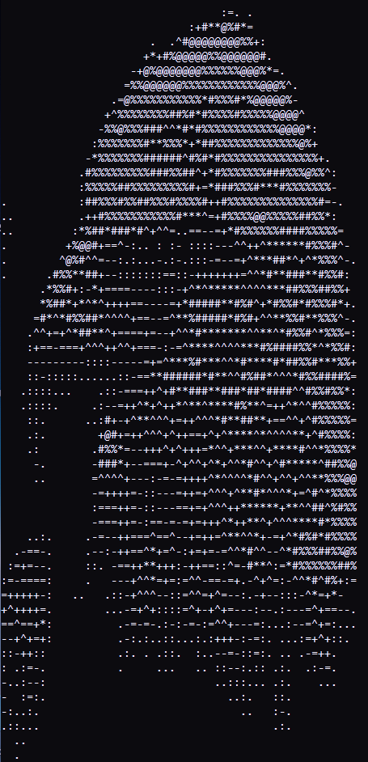

## to_ASCII-converter

### Introduction
This is a **.bmp** to **.txt** (ascii art) format converter, written on C programming language.

---

Here is an example, of how does it work.
Source **eagle.bmp** image:


And coverted to ascii result:



Image, that will converted to ascii should
has a small size, because of it will be a lot of chars in document.

### Installation (Windows)

- #### Step 1 - clone repository
First of all you need to clone repository. The following command to do it:

    git clone https://github.com/Nikita-bunikido/to_ASCII-converter.git

- #### Step 2 - compile it

Next, you should to
compile it. Following command to compile in
terminal:

    gcc toascii.c -o "C:\Windows\System32\toascii"

**Why compiling to System32?**
If you compile it into ```System32``` folder, you can run program in any directory.

If you haven't ```gcc``` compiler you can download installer [here](http://www.equation.com/servlet/equation.cmd?fa=fortran).

### Usage
```
usage: toascii [file] [width] [heigth] [path to save]
```

Path to save is not important if you need
to see result in command line.


You need to try some bitmaps
to convert in folder *examples*, and some results
of converting in folder *results*.

---

# Update: now you can convert videos

## Installation (Windows)

The same as a image version.
But you should to
compile another file. Following command to compile in
terminal:

    gcc video_toascii.c -o "C:\Windows\System32\video_toascii"

### Usage
```usage:``` Open terminal, and execute it. Than you need to choose the frameon your screen, that will be converted.  Move your cursor to *upper left corner* of your frame and press **space**. Then
move your cursor to *lower right corner* and press **space**. Then press **space** again, to start converting process. All windows in your selected area will be converted into ascii art in command line.

---